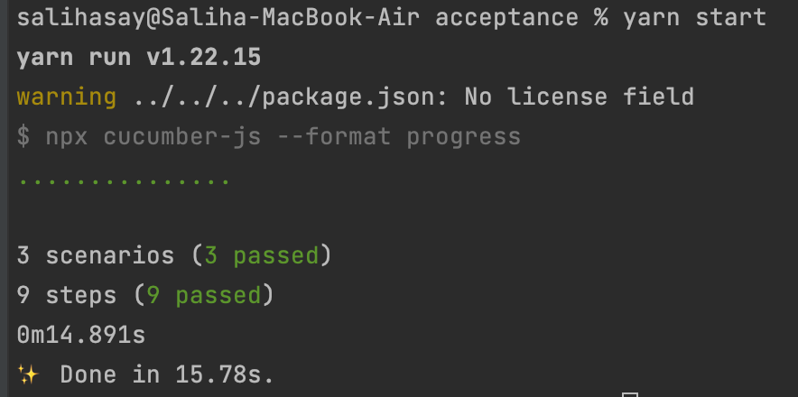
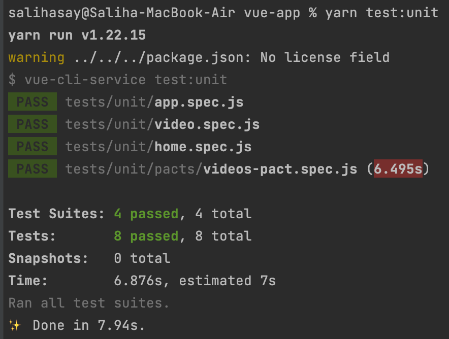

# YOUTUBE ASSİGNMENT WİTH ATDD/TDD CYCLE


```gherkin
Feature: Video Site Project
  As Product Owner I want to surf on our video site project

  Scenario: User should see some videos on main page
    Given that User goes to Video Site Project's HomePage
    When page is loaded
    Then User can see some of videos' title like
      | Vue.js Course for Beginners [2021 Tutorial] |
      | Vue JS Crash Course                         |
      | ue 3 - What's New? What Changed?            |

  Scenario: User should navigate to watch page on click to video
    Given that User is on Video Site Project's HomePage
    When User clicks "Vue JS Crash Course" video
    Then User should see watch url correctly

  Scenario: User should see video image change on hover
    Given that User is on Video Site Project's HomePage
    When User hovers "Vue.js Explained in 100 Seconds" video
    Then User should see hovered image
```

<br />

## **TITLES**

* [Description](#description)
* [Technologies](#technologies)
* [Setup](#setup)

<br />

## Description

<br />

Below is results of our acceptence tests



<br />

Below is results of our unit tests and pact test.



<br />

<br />

## Technologies
---
Project is created with:
* **Vue**
* **Puppeteer**
* **Jest**
* **Cucumber**
* **Javascript**
* **HTML5**
* **CSS3**


<br />

## Setup And Run
---

For run acceptence tests;

```
$ yarn install
$ yarn start
```

For run unit tests

```
$ yarn install
$ yarn test:unit
```

For run only pact test

```
$ yarn install
$ yarn test:unit pacts/
```

<br />
